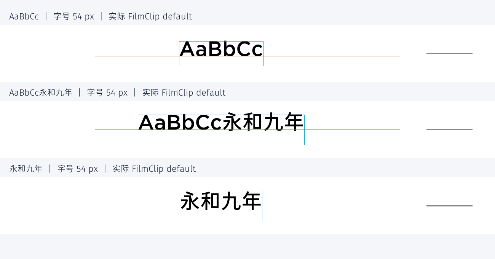

# Gotham / GlowSans 中西文混排：问题诊断与证据

定稿日期：2026-09-25。诊断代码基准：`dev`，`b6c1c43707693caf39097d42c9fde1e081d3784b`。

**诊断已定稿，生产修复未实施。** 定稿时核对的 `src/` 与上述基准无差异；此前试验性代码已撤销。具体实施步骤已独立到 [中西文混排基线修复执行方案](FONT_BASELINE_EXECUTION_PLAN.md)，本文保留现象、证据、根因、定位公式和验收标准。

**唯一核心目标：保留现有样式的纯西文最终基线；混排和纯中文沿用该基线。** 不使用光学校准，不要求中西文字形的可见底部、顶部或重心完全一致，不通过修改样式 margin、字号或字体文件实现补偿。

| 阅读目的 | 位置 |
|---|---|
| 理解用户看到的现象、修复效果和限制 | 第 1～4 节 |
| 核对缺陷及修复范围 | 第 5、9 节 |
| 获取唯一的定位公式和验收标准 | 第 6～7 节 |
| 查阅证据、重测工具当前状态及限制 | 第 8、10 节 |
| 交给另一智能体实施 | [独立执行方案](FONT_BASELINE_EXECUTION_PLAN.md)，按 A → B → C 顺序执行 |

本文保留第 1～10 节编号，便于已有报告继续引用。测量值、代码推导和待实施方案分别标明；不把几何重建或历史试验写成当前生产修复已通过。

## 1. 结论

用户反馈的两个现象可以复现，而且来源不同：

1. **一行内底部不齐**：现有算法对齐的是字体的共同基线，不是可见字形的底部。GlowSans 中文轮廓跨过基线，Gotham 的普通拉丁字母底部更接近基线。这是原生字形相对基线的位置差异，不应把未添加光学补偿视为必须修复的算法缺陷。
2. **混排行相对纯西文上移**：测量时，行高由实际出现字体的最大 ascent/descent 决定；绘制时，基线偏移却优先使用 Gotham 的 ascent/descent。加入中文使盒子变高，居中/底部对齐把盒顶上移，但盒内基线偏移不变，西文段随之上移。
3. **基线算法有缺陷，但需要区分层次**：`baseline - segment_ascent` 配合 Pillow 默认锚点的换算本身正确；布局盒、基线、视觉边界三者的定义不一致才是主要缺陷。多行递推和空行处理另有实际问题。
4. **GlowSans 基线与中文可见底部确有距离**，这是本地字体文件的真实字形设计，不足以判定字体文件损坏或字体基线错误。不能把 `descent` 当成需要补偿的视觉距离。
5. **重测确认原基线位移，也解释了为什么整行看起来变化更大**：54px 居中样本的西文基线移动 -7px、整段墨迹顶部变化 -12px、像素加权重心变化约 -8.84px。这些描述不同方面，不能互相替代。

对用户体感的解释是：输入中文后，原来的西文确实被抬高，同时中文向上、向下扩展了整行的可见边界。整行外观因此变化，不能用“基线只有 7px”否定这种观感；也不能把整行顶部变化的 12px 全部当作应补偿的距离。没有感知实验支持将像素重心或顶部边界等同于人的主观感受。

**修复后应看到：原有西文停在原处，新增中文按同一基线绘制；中文仍可能显得更高、底部更低。** 后者是本需求下保留的字形差异，不是修复失败。若还要求整行视觉轮廓或重心保持不变，就需要另一个排版目标，与本次“不做光学补偿、保留西文位置”的约束不同。

方案将逻辑定位与墨迹边界分开：越出逻辑盒的墨迹只记录，不自动移动基线。核心验收解决语言变化导致的纵向跳动；关联问题按第 9 节划分范围。

## 2. 复现范围与方法

重点样式为 `src/frame_styles/configs/胶片夹风格 FilmClip/default.yaml`。其内部 `name` 目前写为“扩展宝丽来风格 Polaroid Motto”，本报告以目录和变体文件为准。

- 输入分别为 `AaBbCc`、`AaBbCc永和九年`、`永和九年`。
- 原图尺寸 3000×2000；`custom_text` 字号比例 0.027，实际字号 54px。
- Gotham-Medium.otf 与 GlowSansSC-Normal-Medium.otf；另外检查了 Light、Book/Regular 两组字重及 12/27/54/81/100px。
- 使用真实 `TextRenderer.render()`、`LayoutEngine`、`FontManager` 和 `RenderContext`。FilmClip 的布局、字体及颜色配置直接读取原 YAML；提供最小模拟 EXIF 以满足底部信息树的依赖。
- 捕获真实 `draw.text()` 调用，记录字体实际加载路径、绘制位置、基线和逐段非零像素包围盒。辅助测试仅临时替换 alignment 或构造多行 defined_texts，不回写 YAML。
- Pillow 12.2.0，FreeType 2.14.3，fontTools 4.63.0。字体 SHA-256、字体表和全部测量见 [measurements.json](diagnostics/font_baseline/measurements.json)。

本文将实际绘出的非零像素称为“墨迹”。“墨迹盒”是这些像素的最小包围盒；“布局盒”是排版引擎用于定位和留间距的矩形，两者不必重合。一个 run 指使用同一字体连续绘制的文本段。

墨迹边界采用半开区间，底边为最后一个有墨像素的下一行；下文“底部低 Npx”指该边界差。字体轮廓坐标向上为正，图像坐标向下为正，负位移表示向上。所有表中距离均为源图像素，不是缩放预览中的屏幕像素。

原始诊断没有操作 GUI、跑完整单张/批量 CLI 或打包；定位结论针对它们共用的文字渲染模块。没有把全部样式逐个截图验收；“影响多个样式”来自共用代码路径，具体位移受 alignment、相对定位、树定位和 padding 影响。

## 3. 现象一：共同基线不等于共同视觉底部

### 3.1 字体真实度量

本地三组字重的以下全局度量一致：

| 字体 | unitsPerEm | hhea ascent / descent | OS/2 typo ascent / descent | 54px getmetrics | 100px getmetrics |
|---|---:|---|---|---|---|
| Gotham | 1000 | 960 / -240 | 800 / -200 | 52 / 13 | 96 / 24 |
| GlowSansSC-Normal | 1000 | 1160 / -288 | 880 / -120 | 63 / 16 | 116 / 29 |

当前环境 `getmetrics()` 返回的 descent 为正的距离，其实测值与这里的 hhea 度量及像素取整相符。不要直接把字体表中的负 descent 代入现有正距离公式，也不要误用 OS/2 typo 数值替代实际 Pillow 返回值。

Medium 字重、同一基线 B 下的实际像素范围：

| 字号 | Gotham `AaBbCc` 顶/底，相对 B | GlowSans `永和九年` 顶/底，相对 B | 中文底部比西文低 |
|---:|---|---|---:|
| 12 | -10 / 0 | -11 / +1 | 1px |
| 27 | -20 / 0 | -23 / +2 | 2px |
| 54 | -41 / +1 | -46 / +4 | 3px |
| 81 | -60 / +1 | -69 / +6 | 5px |
| 100 | -74 / +1 | -85 / +8 | 7px |

这说明字体字号相同也不意味着可见高度相同：100px 时，示例中文可见高 93px，西文 75px。修正底部不会自动使顶部、中心或视觉大小也一致。

### 3.2 GlowSans 的基线偏差到底是什么

Medium 的字形轮廓，以字体设计单位计，`永/和/九/年` 的最低 y 分别为 `-69/-69/-74/-71`，即约有 **0.069～0.074em** 位于基线下。100px 栅格化后，示例整段底部在基线下 8px。

这不是所有汉字统一下探 8px：`国/口/田` 的轮廓最低 y 为 `-33/+16/-14`。100px 时 `国口田` 整段下探 4px；中文标点还会不同。Light/Regular 的 `永和九年` 在 100px 下探 7px，Medium 下探 8px。

Gotham 同样不是所有字母底部都在基线上：Medium 的 `A/B` 轮廓最低 y 为 0，`a/b` 为 -11，`C/c` 为 -12；圆弧有少量下探。`gypq` 在 100px 下探 16px，是正常下行部。**不能为了“底部齐”把每个实际文本段的最低像素硬贴到同一水平线，否则 g/p/y 等字母会被错误抬高。**

用户已明确排除光学补偿。以下建议仅调整度量和布局算法，保留各字体的原生基线关系与字形差异。

## 4. 现象二：为什么混排会整体上移

### 4.1 实际代码链路

- `src/core/text_renderer.py:291–302`：纯字体单行使用 `height = ascent + descent`；局部虽算出 `text_height = bbox[3] - bbox[1]`，实际没有用于注册高度。
- `src/core/text_renderer.py:326–336`：混排 `height = max_ascent + max_descent`，但 `ref_font` 优先选已出现的 latin 字体。
- `src/utils/layout_engine.py:307–337`：居中对齐从锚点减去 `height // 2`；底部对齐减去 `height`。
- `src/core/text_renderer.py:431–438`：纯排基线等价于 `y + ascent - descent`；混排基线为 `y + ref_ascent - ref_descent`。

设固定锚点为 Y，纯西文行高为 H_L，混排行高为 H_M，Latin 度量为 A_L/D_L；无 padding 或树的额外平移时：

```text
纯西文：B_L = Y - alignment_offset(H_L) + A_L - D_L
混排：  B_M = Y - alignment_offset(H_M) + A_L - D_L
所以：  B_M - B_L = -[alignment_offset(H_M) - alignment_offset(H_L)]
```

54px 的 H_L=52+13=65，H_M=63+16=79。因此顶部对齐不移动西文基线，居中上移 39−32=7px，底部对齐上移 14px。

### 4.2 FilmClip default 实测

原配置 `position: top-center`、`alignment: center`、`margin_top: 0.11`，Y=280。使用相同原图和锚点：

| 文本 | 注册盒 y / height | 真实基线 | 西文像素 y 范围 | 中文像素 y 范围 |
|---|---|---:|---|---|
| AaBbCc | 248 / 65 | 287 | [246,288) | — |
| AaBbCc永和九年 | 241 / 79 | 280 | [239,281) | [234,284) |
| 永和九年 | 241 / 79 | 288 | — | [242,292) |

可直接得到：

- 混排中的西文逐像素上移 7px，确实发生了坐标变化。
- 混排内部中文底部比西文低 3px。
- 混排总墨迹中心从纯西文的 267 变为 259，即此样本包围盒中心上移 8px；该中心指标不是感知重心。
- 纯中文与混排高度都为 79，但参考字体切换使中文基线从 288 变为 280，中文段也上移 8px。即使盒高没变，参考字体的选择仍会引入跳动。



青框为注册布局盒，红线为实际基线，右侧灰短线为共同锚点 Y=280。每幅裁剪使用相同原图区域及比例，只在报告图中分行摆放。

因此，“所有样式都有混排不齐”与共享机制一致；但不能推出“所有 alignment 都向上移动同样距离”。`top-center` 控制实验中，西文基线移动为 0px，而中文仍更高且底部更低。relative 的 `cross_alignment: center/bottom` 和树包围盒也会受到行高变化影响。

### 4.3 独立重测与复评：保留数值，区分位移和内容变化

2026-09-25 复评重新调用重测模块，对以下 `center` / `AaBbCc永和九年` 相对 `AaBbCc` 的尺寸矩阵进行了复核，结果可复现。负值表示图像坐标向上；所有距离均为源图像素，重心保留两位小数。

| 原图尺寸 | 实际字号 | 西文基线位移 | 整段墨迹顶部变化 | 整段墨迹底部变化 | 像素加权重心 Y 变化 |
|---|---:|---:|---:|---:|---:|
| 2400×1600 | 43px | -5 | -9 | -2 | -6.51 |
| 3000×2000 | 54px | -7 | -12 | -4 | -8.84 |
| 4000×3000 | 81px | -10 | -19 | -5 | -12.80 |
| 6000×4000 | 108px | -14 | -27 | -7 | -17.75 |
| 2000×3000 | 54px | -7 | -12 | -4 | -8.84 |

重心定义为以抗锯齿 mask 灰度为权重的像素坐标平均值，是描述墨迹分布的统计量；不能直接认定为人眼的感知中心，也没有证据认定墨迹顶部是“人眼最先察觉”的唯一指标。基线虽不可见，但同一西文段随基线移动后的字形位置变化可直接测量。

复评另用捕获的真实绘制坐标在完整画布上构造 mask，独立计算非零像素框及加权重心。54px 纯西文真实墨迹框为 `(1531,246,1749,288)`，混排为 `(1423,234,1856,284)`；重心 Y 分别为 269.5802 和 260.7435，差约 -8.8367px。重测脚本曾有局部坐标换算错误，目前已修正，当前保存的主测量数据与独立结果一致（见第 10 节）。

为检验验收要求，复评仅在内存中把该混排样本的全部 run 下移 7px，使基线由 280 恢复到纯西文原基线 287，保留字体、内容和横向位置，再栅格化测量：

| 相对纯西文的指标 | 当前生产行为 | 内存中恢复原西文基线后 |
|---|---:|---:|
| 西文基线位移 | -7px | **0px** |
| 同一西文段的墨迹顶部/底部变化 | -7px / -7px | **0px / 0px** |
| 整段墨迹顶部变化 | -12px | -5px |
| 整段墨迹底部变化 | -4px | +3px |
| 整段墨迹边界中心 Y 变化 | -8px | -1px |
| 整段像素加权重心 Y 变化 | -8.84px | -1.84px |

这里的“恢复后”是单个样本的几何重建，用于检验方案逻辑，不是已实施算法的回归结果。当前生产代码仍输出表中第二列。

可见顶部 -12px 由“基线移动 -7px”与“新增中文字形向上扩展 -5px”共同形成，不能将 -12px 当作整行刚性移动量。恢复基线后，西文段的像素 y 范围回到 `[246,288)`，整段混排墨迹为 `[241,291)`；继续移动整行使其顶部或重心与纯西文重合，会破坏刚恢复的西文位置。**本次要消除的是原有西文段的纵向移动，不是不同文本内容之间的全部墨迹统计差异。**

尺寸矩阵补充了实际渲染覆盖，但不证明严格线性规律：字体栅格化、度量取整和中心取整都会造成离散变化，小字号见第 5.8 节。源图位移也不等于屏幕预览位移，后者还受显示缩放比例影响。该矩阵验证的是独立文字渲染路径；FilmClip 完整渲染还有 `default_portrait_adaptation: clockwise` 的旋转适配，不能据此宣称整个应用中位移与横竖图处理无关。

## 5. 当前算法的具体缺陷

### 5.1 正确部分：逐段基线换算

Pillow 横排默认锚点是 `la`（左侧 ascender），不是墨迹顶。当前 `draw.text((x, B - ascent), ...)` 与 `draw.text((x, B), ..., anchor='ls')` 在本次字体上逐像素一致，两种字体都通过了图像差分断言。[Pillow 官方锚点说明](https://pillow.readthedocs.io/en/latest/handbook/text-anchors.html)

所以只改成 `anchor='ls'` 能让代码更清晰，**不能单独解决任何一个已复现的偏移根因**。

### 5.2 主要缺陷：混用了三种边界

1. 字体全局度量盒：由 ascent/descent 给出，不随具体字形变化。
2. 文字墨迹盒：取决于具体文字、字重、字号和字体。
3. 元素布局盒：提供给九点 alignment、相对定位、树定位及 padding 的几何矩形。

当前将 1 当成 3，却在部分注释中承诺它等于 2。`layout_engine.py:527` 的“参考包围盒底 = 参考视觉底部”对文字不成立，`_compute_visual_bounds()` 实际也只合并注册盒。

进一步说，即便把注册盒解释为字体全局度量盒，绘制仍不自洽。真正度量盒顶 y 对应的基线应为 `y + ascent`，当前却多减了 descent。混排还用 max 值测量、ref 值定位。FilmClip 混排注册盒 [241,320)，实际墨迹 [234,284)：**墨迹顶部越出盒顶 7px，盒底又多出 36px 空白**。这会使相对间距、树定位和 padding 的视觉效果与几何预期不一致。

### 5.3 多行基线递推缺陷

`layout_engine.py:769–779` 只用首行的 `ref_ascent-ref_descent` 初始化基线，后续直接加上一行的 height 和行间距。它没有根据当前行的基线偏移做转换。

若按当前单行规则保持一致，递推应包含 `offset_next - offset_current`；或者先逐行求 line_top，再求该行 baseline。当前写法仅在所有行基线偏移一致时自洽。

54px、行间距 12px 的实测：

| 内容 | 实际两行基线 | 第二行若按其单行规则放置 |
|---|---|---:|
| AaBbCc → 永和九年 | 319 / 396 | 404（当前高了 8px） |
| 永和九年 → AaBbCc | 327 / 418 | 410（当前低了 8px） |

这里的“应为”是对现有单行规则的一致性比较，最终修复仍应使用统一的新行模型。

### 5.4 空行测量和绘制不一致

`text_renderer.py:210–212` 遇到空行只增加 total_height，不向 line_infos 添加空行。`AaBbCc\n\nAaBbCc` 注册高度为 154px，但实际两行基线仍为 319/396，与只换一次行的间距相同。空白没有保留在指定位置，居中/底部布局又会被额外总高度影响。

这是多行分支的关联缺陷。当前 custom_text 会主动把换行变空格，因此用 defined_texts 复现；不能把它说成 FilmClip 单行样例的根因。

**全空行文本会崩溃**：代码检查表明，`defined_texts.content` 为 `"\n\n"` 等纯换行字符串时仍进入渲染队列，但行测量跳过全部空行，留下 `lines=[]`。`layout_multiline_lines()` 随后访问 `lines[0]`，触发 **IndexError**。custom_text 因预先把换行转换为空格，不走这一触发路径。[执行方案第 4 节](FONT_BASELINE_EXECUTION_PLAN.md)保留空行槽但不绘制墨迹，不跳过整个全空行元素，也不将其注册为 0 高度。

### 5.5 空格也会触发参考字体切换

在当前 `split_mixed_text()` 规则下，进入 `len(segments) > 1` 必然同时存在 CJK 段和非 CJK 段，因此混排分支的 `drawn_fonts['latin']` 一定存在；`or drawn_fonts.get('cjk')` 并不提供实际可达的另一种参考。纯中文前后只增加 ASCII 空格，也会切入混排路径、改用西文参考。这是第 4.2 节纯中文与混排基线不一致的另一触发方式，应列入核心验收。

### 5.6 墨迹越界会使 padding 和树边界失真（强相关）

这补充了第 5.2 节，不是另一个独立的中文上移原因。现有混排使用西文参考基线，但实际字符可能比参考行盒更高。54px Medium、以布局盒顶为 y=0：

| 当前原始实现 | 注册高度 | 基线相对盒顶 | 墨迹 y 范围 | 顶部越界 |
|---|---:|---:|---|---:|
| 纯西文 AaBbCc | 65 | 39 | [-2,40) | 2px |
| 混排中的 AaBbCc | 79 | 39 | [-2,40) | 2px |
| 混排中的 永和九年 | 79 | 39 | [-7,43) | 7px |
| 纯中文 永和九年 | 79 | 47 | [1,51) | 0px |

100px 时，混排中的中文顶部相对盒顶为 -13px。这些数值可由原始 measurements.json 的字体度量、墨迹范围和第 4.1 节公式得到。

因此逻辑盒贴到 padding 顶缘时，字形仍可能越界；树合并注册盒也不能识别这部分墨迹。多减 descent 是盒原点和基线定义不自洽的一部分，不是要额外添加的中文校准量。

**证据适用范围修正**：补充审计的 vertical_boxes 是“统一西文参考”试验模型的计算结果，其纯中文也使用西文基线。试验已经撤销，不能将其中“纯中文越界 7px”的结论直接套用到当前恢复后的纯中文路径。上表已按当前原始路径区分。

### 5.7 横向 bbox、advance 和 bearing 混用（强相关，非纵向根因）

这将第 5.5 节的风险补充为已量化的问题。bbox.left/right 是相对绘制原点的边界，而 advance 是下一段原点应前进的距离。当前用 bbox.right-bbox.left 推进，又直接从原点绘制，既丢失边界偏移，也误用推进量。

Gotham Medium 54px 的 j：bbox x=[-1,15]，当前宽度为 16px，advance 为 15px。在 j永 中，中文原点被推到 16px，较字体 advance 多 1px；注册宽 70px，advance 总和 69px，实际墨迹左侧又越出原点 1px。

Gotham-MediumItalic 100px 的 j：bbox x=[-13,34]，宽度 47px，advance 29px，相差 18px。斜体是字体管理器可加载的文件样例，不代表内置默认样式采用斜体。

影响包括段间距、居中/右对齐和相对定位宽度。建议使用 getlength() 推进，各段相对原点的 bbox 单独合并。getbbox() 也不是严格的非零像素盒，若验证要求像素级范围，应另外测量 mask。

**重测初稿的横向归因已撤回**：重测以 `AaBbCc` 为所有文本的对照，得到 `Hello世界` 与 `世界Hello` 在 108px 下的横向重心变化约 +17.3px 与 -2.5px。复评实测该字号 `Hello` 的 bbox 宽与 advance 均为 280px，`世界` 均为 216px；改用 advance 重建这两个样本，原点和墨迹统计没有变化。文本内容和顺序本身会改变墨迹分布，这组重心数据不能证明推进算法触发了误差。修订后的重测报告已接受这一点。

修订稿新增的 `j永和九年`、Medium 54px 固定原点对照有效：bbox 推进时第二段 x=96，advance 推进时 x=95。但“误差仅 1px/处”不能推广到其他字形或字重，上述斜体样例已达到 18px。

本节的 `j` / 斜体样例仍是独立有效证据。后续横向验收应固定同一文本、字体和字号，选择 bbox 宽确实不同于 advance 的样例，比较各 run 原点与预期推进量。不能要求不同内容的 `gravity_shift_x` 一律为零，也不能把因文本变宽而发生的正常居中横移当作错误。

### 5.8 小字号整数化与 12px 下限（直接回应比例偏差）

代码存在以下离散化环节：

- 字号为 max(12, int(reference_side × size_ratio))。
- 边距、偏移与行距多处使用 int()。
- 中心对齐使用 height//2 或 width//2。
- 混排推进使用整数 bbox 宽，丢弃 getlength() 可提供的小数精度。

单个 1px 误差占 12px 字号的 8.3%，占 100px 字号的 1%；但这只是敏感度示例，不能据此认定每张图都出现固定 1px 的纵向偏移。bearing 主要影响横向，行高度量和中心取整才直接影响本问题的纵向坐标。

**当前恢复后的原算法也没有固定中文上移常量。** 居中偏移由两种行高取整后的一半之差决定。例如 Medium 12px 的西文/混排行高为 15/18px，上移 2px；54px 为 65/79px，上移 7px；100px 为 120/145px，上移 12px。小字号相对比例确实可能更大。

新增小字号复核的基线数据已通过真实 TextRenderer 再测。以下均为本次 Medium 样本、居中且未因夹持增加纵向移动的结果；占比取位移绝对值：

| 字号 | 西文/混排行高 | 基线位移 | 位移占字号 |
|---:|---|---:|---:|
| 12px | 15 / 18 | -2px | 16.7% |
| 13px | 17 / 20 | -2px | 15.4% |
| 16px | 20 / 24 | -2px | 12.5% |
| 19px | 24 / 29 | -2px | 10.5% |
| 20px | 25 / 30 | -3px | 15.0% |
| 27px | 33 / 40 | -4px | 14.8% |

因此，小字号下“同样几像素看起来占比更大”有数据支持，但偏移不是全局固定值，占比也不是随字号单调变化。不能用严格比例关系外推所有字号。

小于 12px 的目标字号被下限抬至 12px，而 margin 等仍随原图尺寸缩放，也会改变文字与边距的比例。是否调整字号下限需要另行确认；文档建议先保留中间计算精度、统一最终取整，并记录目标字号和实际字号。

### 5.9 Unicode 分段会影响字体选择和度量（关联边界）

`_CJK_CHAR_RE` 与 `FontManager.split_mixed_text` 位于 `src/utils/font_manager.py:21-25`、`59-72`（`text_renderer.py:176` 是 custom_text 换行替换，非分段逻辑）。_CJK_CHAR_RE 未覆盖韩文、扩展 B 等高平面汉字和变体选择符。实测“中文𠀀”的后一个汉字被归入 Latin，“永”后的变体选择符也被拆成 Latin 段。这会影响字体选择、advance 和 bbox，甚至在现有算法中改变参考字体。

该问题与混排入口强相关，但不是 AaBbCc永和九年 的已知根因。建议按字素簇保持组合字符完整，再依据文字脚本和实际字体覆盖选择字体。扩充分段范围也不保证 GlowSans 一定包含所有这些字符，需要同时验证 cmap 和回退。

### 5.10 多行入口不一致与超长文字（相关后续问题）

custom_text 在第 176 行主动把换行替换为空格，CLI 帮助却声称支持多行。因此第 5.3、5.4 节的多行问题应通过 defined_texts 等实际多行入口复现，不能以 custom_text 输入换行后未分行来验证行基线算法。

此外，padding 夹持只能平移，不能把大于可用区域的文字盒变小。100×100 画布、四边 10px padding、100×100 元素，结果为 (10,10,100,100)，右侧/底部仍各越过安全区 20px。它不是本次常规字号混排上移的原因，但与文字盒安全边界方案有关。建议检测超大盒并明确允许越界、换行、缩小或报错的产品规则；本次不替用户选择规则。

## 6. 按西文既有基线约束修订的方案（未实施）

### 6.1 目标和取舍

用户明确要求：现有样式是按西文排版设计的，最终呈现必须以西文既有基线为准。因此目标不仅是“纯西文和混排位置一致”，还必须“与当前样式原先的纯西文位置一致”。把两者一起移动到一个新的共同基线，仍不符合要求。

每个文本元素应使用样式配置的 Latin 字体、该元素的字号与字重作参考；参考不取决于文本是否真的包含西文。纯中文、混排、标点和空格都沿用这一参考。字号、光学 delta、校准字集及逐段视觉底部补偿均不作为解决手段。

严格按实际墨迹框居中与原西文基线完全不动，通常不能同时成立，因为加入更高字形会改变墨迹框。建议明确使用稳定的逻辑行盒定位，实际墨迹作为独立边界记录。

### 6.2 基线定位契约：只由西文逻辑行盒决定

对同一个样式元素、原图尺寸、字号和行数，使用以下兼容定义：

    A_L, D_L = 实际加载的配置西文字体.getmetrics()
    H_L = A_L + D_L
    baseline_offset = A_L - D_L
    y_L = 按原样式 alignment / relative / tree / padding 计算的西文逻辑盒位置
    B_L = y_L + baseline_offset
    各段以 (run_x, B_L - 该段字体.ascent) 配合默认 la 锚点绘制

也可以用 (run_x, B_L) 与 ls 锚点等价绘制。段内不能再减该段 descent，不能以中文 ascent、中文行高或实际墨迹顶底改变 B_L。

这里保留 A_L-D_L，是为了保留现有西文呈现位置；它是应用既有的布局盒到基线的偏移约定，不应当被当作标准字体度量盒定义。直接改为 y_L+A_L 会把纯西文下移 D_L，违背本次兼容要求。

纯中文仍加载并使用配置西文字体作为定位参考，中文字体只决定中文字形绘制。字体缺失时，记录并使用实际回退西文字体；换了字体文件或回退字体以后，不能保证与原字体的像素位置完全相同。

**缺省参考的实施约定**：当前 `fonts.latin` 缺省或为空字典可走系统西文回退；显式为 `null` 时，加载西文字体会在 `None.get(...)` 抛 `AttributeError`。`fonts.cjk: null` 在加载中文字形时有同样问题。实施时在局部配置副本中对两者统一规范化：缺省或 `null` 转为 `{}`，非法类型明确报错；随后各自按现有系统西文/中文字体链回退。定位参考始终采用 Latin，CJK 只影响字形绘制。细节见[执行方案 B1](FONT_BASELINE_EXECUTION_PLAN.md)。这是尚未实施的方案约定。

FilmClip default、54px 的复核结果和目标：

| alignment | 当前纯西文基线 | 当前混排基线 | 当前纯中文基线 | 三者应统一使用的基线 |
|---|---:|---:|---:|---:|
| top-center | 319 | 319 | 327 | 319 |
| center | 287 | 280 | 288 | 287 |
| bottom-center | 254 | 240 | 248 | 254 |

当前生产代码仍为未修复版本。上述目标来自现有纯西文实际位置，没有引入新的光学参考线。

### 6.3 度量分离不能改变定位优先级

| 数据 | 用途 | 是否随本次文本内容变化 |
|---|---|---|
| layout_box / baseline_offset | alignment、相对/树定位及既有 padding 夹持 | 垂直范围只使用配置西文度量 |
| advance | 推进下一个 run、记录排版宽度 | 是 |
| safety_bounds | 检测字体度量范围是否越界，记录诊断 | 可基于完整字体组合，但不反向参与定位 |
| ink_bounds | 实际字形边界、调试、碰撞诊断 | 是 |

配置字体组合可以用于安全范围估计，但最终定位只采用西文逻辑行盒。中文更高或更低的原生墨迹可以超出逻辑行盒；逻辑盒不是紧墨迹盒，这一点必须在注册表和日志中明确。

此前提出的两种方向现在作如下收敛：

1. **排除最大字体度量行盒用于定位**：即便每次都计算相同的 Latin/CJK 最大 A/D，能够避免随输入跳动，它仍会改变现有纯西文位置与行距，不符合此次要求。
2. **保留西文既有位置**：使用第 6.2 节公式，将真实字形度量与定位度量分离；这才符合明确后的需求。

安全范围相对逻辑盒顶仍可估计为：

    baseline_offset = A_latin - D_latin
    safety_top = baseline_offset - max(配置字体 ascent)
    safety_bottom = baseline_offset + max(配置字体 descent)

这些是基于字体度量的边界，不是光学校准。全局度量未必严格涵盖所有特殊字形，应保留 ink_bounds 诊断。

**安全检查不能自动移动基线。** 现有 padding 对逻辑盒的夹持行为保持，由固定西文逻辑高度参与计算；新增 safety_bounds 和 ink_bounds 只检测并报告越界，不能自动扩大定位盒、上移整树、缩小字体或重新居中。

此前“让 padding/tree 使用更大 safety_bounds”的建议会改变现有纯西文的最终位置，现明确排除出本方案。后续如需严格防裁切，应单独评审允许越界、调整样式边距、扩大画布或拒绝渲染等策略，不默认赋予移动基线的优先级。

### 6.4 多行、相对定位与树定位也必须使用西文参考

单个元素通常所有行同字号。若有 N 个行槽，西文行高为 H_L，行距为 S：

    block_height = N * H_L + (N - 1) * S
    baseline_i = block_y + i * (H_L + S) + A_L - D_L

每行都以西文为参考；不能由首行使用的语言决定后续行偏移，也不能让混排行的 max_ascent/max_descent 改变行距。空行需要占位；原实现错误处理空行，纠正后有空行文本的后续行位置会改变，应在实施前明确说明。这不应改变无空行纯西文的既有位置。

相对布局 cross_alignment 和 tree_align 均继续使用各元素的西文逻辑高度。不同元素可以有不同西文字号，因此“以西文为准”不意味着把不同字号、不同位置的元素强行放在同一条绝对基线上。

### 6.5 横向相关问题保持独立评审

- getlength() 用于 run 原点推进；带符号的 bbox.left/top/right/bottom 用于外接范围合并。
- 保留 advance 的小数精度，统一最终坐标量化；不能把所有 bearing 补偿到段间距。
- 更正宽度可能改变居中/右对齐时的 x；含 above/below 依赖、不同宽度下的夹持等复杂布局还应单独检查。不能把横向修复混入“纯西文全部像素不变”的无条件承诺。
- 先保留现有字号、margin 和中心取整规则。将 //2 改为 /2 或重新定义舍入，也可能改变现有西文位置，不属于本次保持基线的必要修复。
- custom_text 是否支持多行、全局字体分类改造及超大盒策略另行评审，不为修复本示例扩大变更范围。

### 6.6 不建议的修法

仅改 margin、仅删除 -descent、仅替换 ls 锚点、把字体 descent 差当成中文上移补偿，都无法同时解决内容相关位置变化与边界问题。逐段采用视觉底部锚点会破坏 g/p/y 下行部，不符合保留原生字体关系的要求。

上述均为方案，当前生产代码未采用。

## 7. 核心验收标准

以下标准针对同一字体环境、样式、字号、画布和行数；含空行文本的旧错误行为例外见[执行方案第 4 节](FONT_BASELINE_EXECUTION_PLAN.md)。具体矩阵见[执行方案第 7 节](FONT_BASELINE_EXECUTION_PLAN.md)。

| 编号 | 通过条件 | 判断方法 |
|---|---|---|
| AC-1：旧西文兼容 | 无空行的纯西文最终基线及字形位置与修复前一致 | 比较修改前真实快照，不能只比较修改后的两组输出 |
| AC-2：混排稳定 | 加入/移除中文后，共同西文段的基线和墨迹 y 范围不变 | 配对 `AaBbCc` 与 `AaBbCc永和九年`；单独提取西文 run，归一水平原点后比较 mask |
| AC-3：纯中文参考 | 无西文字符时仍使用该元素的西文逻辑盒与基线偏移 | 与相同样式、字号下的纯西文基线比较；另测中文前后加空格 |
| AC-4：布局传播 | relative、tree 和 padding 不因语言切换产生额外纵向移动 | 使用固定西文逻辑高度，绘制读取最终移动后的盒坐标；诊断边界不参加定位 |
| AC-5：多行一致 | 所有行使用西文参考；空行按槽占位；纯换行内容不崩溃 | 检查 N 个槽、N−1 个行距、每行 line_top 和 baseline_offset |
| AC-6：实际效果 | CLI 单张/批量及 GUI 输入切换均呈现上述行为 | 核对实际变体、字体、缩放和方向适配；日志无本次新增 ERROR/TRACEBACK |

整段 ink_top/ink_bottom/ink_center 和灰度加权重心只作为诊断数据，**不要求不同内容的差值为零**。54px 指定样本恢复基线后的 -5px 顶部差、+3px 底部差及约 -1.84px 重心差均属允许结果，而非所有字符串必须达到的固定数值。

同理，不要求加入中文后 x 不变：文本变宽会正常改变居中/右对齐位置。advance/bearing 修复、Unicode 全覆盖及超大盒策略属于第 9 节的后续工作，不作为本次核心修复的附带验收门槛。

## 8. 诊断证据与撤销状态

- [原始诊断脚本](diagnostics/font_baseline/diagnose_font_baseline.py)
- [原始测量](diagnostics/font_baseline/measurements.json)
- [原始诊断日志](diagnostics/font_baseline/diagnostic.txt)
- [原始 FilmClip 对照图](diagnostics/font_baseline/filmclip_comparison.png)
- [补充审计脚本](diagnostics/font_baseline/audit_text_box.py)
- [补充审计数据](diagnostics/font_baseline/text_box_audit.json)
- [独立重测报告修订稿（采用范围见第 10 节）](FONT_BASELINE_REMEASURE_REPORT.md)
- [重测脚本（坐标还原已修正）](diagnostics/font_baseline/remeasure_visual_shift.py)
- [当前主重测数据](diagnostics/font_baseline/remeasure_visual_shift.json)
- [新增主张复核脚本](diagnostics/font_baseline/remeasure_verify_claims.py)、[主张复核数据（字段限制见第 10.2 节）](diagnostics/font_baseline/remeasure_verify_claims.json)
- [重测位移汇总](diagnostics/font_baseline/remeasure_summary.md)
- [重测可视化脚本](diagnostics/font_baseline/remeasure_visualize.py)
- [重测叠加图](diagnostics/font_baseline/visual_overlay.png)、[重测尺寸对照图](diagnostics/font_baseline/visual_scale.png)

2026-09-25 复评的独立完整画布测量、基线恢复对照及小字号重测在内存中执行，关键数值与方法记录于第 4.3、5.8、10.2 节；未另存为新的结构化结果文件。后续实施应按[独立执行方案](FONT_BASELINE_EXECUTION_PLAN.md)生成可追溯验证产物，不把本文描述替代为实施后的通过记录。

原始脚本针对文首基准；生产代码恢复后，再次复现应得到原先的 top/center/bottom 西文偏移 0/-7/-14px，而非全部 0px。

补充审计的横向字体度量、字符分类和 padding 函数检查仍适用；其中 vertical_boxes 使用固定西文参考模型，适用范围已在第 5.6 节说明，不应当作当前纯中文渲染的输出。

历史 verification 目录仅保留已撤销试验的结果。曾经通过的“61 组对照、CLI 成功、位移 0px”等结论只适用于该试验，不代表当前代码已修复。对应实现验证脚本已归档为文本，避免在原始代码上误运行。用户原有相机/镜头 CSV 修改保持原样。

当前状态核验：`src/` 与 Git HEAD 无内容差异，核心缺陷仍存在。此前恢复文件的语法检查属于撤销时的验证；本轮只修改 Markdown，无修改后的 Python 文件需要编译。没有版本提交、tag 或合入。

## 9. 核心修复与后续工作的边界

补充审计中与基线问题相关的内容已并入本文；完整审计见 [TEXT_BOX_ALGORITHM_AUDIT.md](TEXT_BOX_ALGORITHM_AUDIT.md)。执行范围按下表，不把“发现问题”等同于“本次全部修复”。

| 审计项 | 实施归属 | 说明位置 |
|---|---|---|
| 混排行高变化、纯中文参考切换 | 核心修复：固定西文逻辑盒和偏移 | 4、6 |
| 多行递推、空行丢失和全空行崩溃 | 核心修复：统一行模型 | 本文 5.3～5.4、执行方案第 4 节 |
| 逻辑盒与墨迹不同、padding/tree | 核心修复中明确语义并记录边界；不做防裁切重排 | 5.6、6.3 |
| 小字号整数化和最小字号 | 核心验证覆盖；保持既有取整与 12px 下限 | 本文 5.8、执行方案第 7 节 |
| bbox 误作 advance、bearing | 后续独立修复，核心阶段保留横向行为 | 5.7、6.5 |
| Unicode 分段和组合字符 | 后续独立修复，记录已知支持边界 | 5.9 |
| custom_text 删除换行 | 后续产品入口决策，核心阶段不变 | 本文 5.10、执行方案第 4 节 |
| 超大盒无法靠夹持容纳 | 后续产品策略，核心阶段只诊断 | 5.10 |
| relative_to 模糊匹配、引用缺失/环/重名 | 通用布局健壮性，留在补充审计 | 不纳入本例基线修复 |

## 10. 重测证据的当前状态与使用限制

### 10.1 已纠正且可以采用的内容

重测修订稿已经撤回“用 12px 推翻 7px”“所有墨迹指标必须归零”“Hello世界 的重心差证明 advance 错误”三项结论。其第 5 节的核心验收方向与本文一致。新增同内容 `j永和九年` 对照及小字号基线数据有效，已分别合并第 5.7、5.8 节。

局部 mask 的坐标错误也已修复：绘制采用 `xy-origin+pad`，还原必须使用 `local+origin-pad`。旧脚本曾误加 pad，使绝对坐标多 `2×pad=4px`；当前脚本和保存的主测量 JSON 已输出正确坐标。旧错误不影响相对差值，历史截图/文本若引用旧绝对坐标则需区别看待。接手智能体无需重复修复此公式。

### 10.2 仍需区分的测量口径

| 证据 | 当前能证明什么 | 不能据此宣称什么 |
|---|---|---|
| `remeasure_visual_shift.py` 主矩阵 | 真实 TextRenderer 下的基线、逐段坐标、整段 mask 指标 | 已覆盖完整 GUI/CLI、方向适配和全部样式 |
| `claim_A_baseline_restore` | 用 `getbbox(anchor='ls')` 推导同基线下字形范围；本例残差已获独立 mask 复核 | 脚本已验证修复前后逐像素相同；其中 `latin_glyph_shift=0` 是直接赋值，不是差分结果 |
| `claim_B_clean_contrast` | 固定文本、字体、起点，仅切换推进量的独立绘制对照 | 所有字形误差至多 1px，或已经验证整个布局引擎的横向修复 |
| `claim_C_small_sizes` | 从实际字体 metrics 按当前中心公式算出小字号基线差；本文另调用真实渲染复核 | 该函数自身走过生产渲染，或其 `ink_top_shift` 是实际整体顶部位移 |

`claim_C_small_sizes.ink_top_shift` 当前只计算**同基线下的字形顶部差**，与主脚本同名字段的口径不同，不能直接合并。交接时按以下解释使用，后续工具若改名应另存产物：

| 字号 | 当前主张 C 字段（基线不动时的残差） | 当前真实渲染整体顶部变化 |
|---:|---:|---:|
| 12px | -1px | -3px = 基线 -2px + 字形残差 -1px |
| 27px | -3px | -7px = 基线 -4px + 字形残差 -3px |

该字段宜改为 `ink_top_residual_at_same_baseline`；实际整体变化另设字段。小字号基线表本身仍成立。本轮没有修改其他智能体的脚本或数据。

### 10.3 接手时的使用规则

1. 主矩阵的最小布局模板已与当前 FilmClip YAML 相关字段核对一致，但模板不是完整样式渲染。以后配置变化需重新核对。
2. `reproducibility` 记录 expected/measured，不会自动判定失败；新增复核脚本也未建立完整的实施验收断言。[执行方案第 6 节](FONT_BASELINE_EXECUTION_PLAN.md)要求独立验证工具，不能只运行这些脚本后看到输出文件就宣布通过。
3. 纯中文的 `baseline_shift` 取的是中文绘制段基线相对纯西文参考的差，不能称为“纯中文中的西文段基线”。没有 Latin run 也必须验收其定位参考。
4. 红青整串叠加图只展示墨迹分布差异。不同字形可相互重叠，文本变宽还会水平移动；不隔离共同 run，就不能由红青成对错位推断同一字形的移动量。
5. `getbbox()` 不是严格的非零像素边界；精确墨迹测量使用 mask。像素重心不是已验证的人眼感知模型；“不可修复的内容差异”在本文统一表述为“本需求下保留的原生字形差异”。
6. 重测修订稿中残留的“原诊断单点/单一指标”“严格正比”“误差仅 1px”不作为本文结论。本文采用经复核的数据和第 7 节验收标准，不要求执行者重新经历各版争议。
