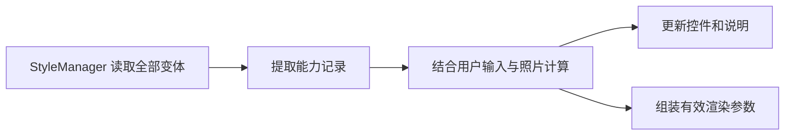

# 样式加载层重构与 GUI 选项能力方案

> v14 · 2026-10-05 · 实施中（阶段一/二已交付）
>
>
>
> v14 按用户验收反馈追加：**11 项选项控件统一 setFixedWidth(200)**（SwitchButton 保持固有尺寸）——实测 qfw ComboBox 的 minimumSizeHint 随当前项文字变化（镜头名 72→114px），动态 logo 长文件名把行最小需求推到 886px ≫ 侧边栏最窄 350px 造成整体溢出；固定宽度后多样式/多选项/长文件名场景几何零漂移、三档侧边栏宽度横向滚动条均无。备注说明静态文案同步精简（最长 19 字→11 字，语义修正「样式启用时可输入」→「布局使用该行时可输入」）；**跨卡对齐（normalize_option_rows）**：五张配置卡的全部选项行统一标签列宽（动态取 max sizeHint，setFixedWidth）与行边距（hBoxLayout.setContentsMargins(24,12,24,12)——注意必须设布局而非 widget 的margins），消除各行 GroupWidget 宽度差（实测 432/454/465px）导致的右侧裁剪溢出；水印卡输入框/下拉/滑条同步统一 200px。全局坐标验证：13 行跨 5 卡控件宽 {200}、右缘距卡片右缘 {25px}、左缘同一像素位置。v13 裁定选项切换不修改分组说明；v12 完成方案重定位。技术行为延续重构后的方案。

## 1. 目标、范围和复杂度

本方案的主线是一次**样式加载层的结构性重构**：把 StyleManager 中混合的四类职责（来源定位、加载校验、变体选择、能力查询）拆分为分层清晰、依赖方向固定的加载管线，让 GUI 与处理器共享同一套规则，消除重复解析，并把"样式能力"提升为可独立消费的一等数据。在此地基上交付功能目标：选择相框样式后，GUI 右侧只允许用户修改这个样式支持的选项。不可用项保留在原位置，变为不可编辑，并说明原因。

判断时必须读取一个样式的全部变体。以 ParamCapsule 为例：空文本会选择 no_custom_text，填写文字后才会选择 default。如果只根据当前变体禁用文字输入，用户就无法再填写文字，也无法切回 default。

因此实现必须同时记录两件事：**全部有效变体决定选项能否编辑；当前变体决定本次是否使用该选项，以及应该显示什么说明。** 背景固定色按当前变体限制，因为背景选择不会触发变体切换。

还要把用户输入和生成参数分开。用户填写作者后切到不支持作者的样式，内容保留在输入框中，但本次生成的 author 参数应为 None。切回支持的样式后，原值继续可用。

需求可行。这是一次**中等偏大规模的重构加功能**：阶段一重构样式加载层（拆分校验子系统、共享规则、能力分析、加载缓存），阶段二在其上接入 GUI 选项能力。无需重做渲染算法。预计新增 4 个、修改 6 个生产代码文件（新增中 style_validator.py 为纯搬运拆分，不新增行为；变体规则与能力分析合并为单一 style_rules.py），另更新指南和验证记录。

本次覆盖 11 项 GUI 选项：作者、拍摄地点、GPS 替换、自定义文本、拍摄时间、镜头显示、镜头名、LOGO、背景填充、背景增强、字重。输出格式、竖图旋转适配、水印保持现有独立规则。不新增样式能力字段，不修改内置样式，不扩大为完整配置校验、像素可见性分析、每样式偏好或自动生成。

## 2. 架构总览、代码入口和实施顺序

### 2.1 重构后的分层架构

样式加载按数据流分四层，每层单一职责、依赖方向固定：

```text
┌─ 消费层 ─────────────────────────────────────────────┐
│  gui_pyside（页面 / 绑定 / 状态计算）   core（处理器） │
└───────────────┬──────────────────────────────────────┘
                │ 只经 StyleManager 公开 API 访问
┌─ 门面层 ──────▼──────────────────────────────────────┐
│ StyleManager：来源定位 + 加载 + 文件缓存               │
│   get_style_config / get_style_capabilities           │
│   invalidate / invalidate_all（4.4）                  │
└──┬──────────────────────────────┬────────────────────┘
   │ 校验（纯函数）                │ 规则与分析（纯函数）
┌──▼──────────────┐    ┌──────────▼──────────────────┐
│ style_validator  │    │ style_rules                 │
│ 定位枚举/旧别名/环│    │ 变体规则区 + 能力分析区       │
└─────────────────┘    └──────────┬──────────────────┘
                                  │ 唯一例外依赖（4.3 防护）
                          ┌───────▼────────┐
                          │ render_context │ 选项依赖表（类级查询）
                          └────────────────┘
```

**依赖方向不变式**：frame_styles 包不依赖 core 与 gui_pyside；style_rules → render_context 是唯一例外，且仅限能力分析区使用（4.3）。文件 IO、缓存、失效只存在于门面层；校验、规则、分析三层全部为纯函数——无文件 IO、无 Qt、无全局可变状态，可独立测试。

**四级数据流水线**（逐级只增不改，全部不可变）：

```text
VariantCandidate（文件身份 + 文件名条件）
  → 加载校验（style_validator + 加载器注入）
  → VariantFacts（单候选能力事实）
  → StyleCapabilitySnapshot（家族能力快照）
  → OptionEvaluation（界面状态 + 有效参数）
```

**设计原则**（优雅与健壮的验收口径，各条对应检查项）：

1. 单一职责：一个模块一个变化理由，新文件职责边界见 2.3 任务表。
2. 纯函数内核：规则区与分析区给定输入得确定输出（C01–C11 可脱离 GUI 独立验证）。
3. 不可变数据：四级流水线用 frozenset / tuple / 冻结 dataclass，跨层无共享可变状态（C16）。
4. 防御边界：外部 YAML 是不可信输入，全部经加载校验；坏候选保留在选择序列、给出诊断、绝不静默回退或跨来源补救（C10/C11/G12）。
5. 缓存透明：命中与未命中语义一致（深拷贝返回），失效显式可枚举，不做隐式新鲜度假设（C18）。
6. 行为保持：重构部分与 T0 基线逐条一致，不改变任何既有选择与校验结果。

### 2.2 当前代码入口

代码核查基线为 dev `7bb1aa3`。执行时必须重新记录 HEAD 和工作区状态，以方法名定位，不能使用历史行号。

重构后的实际入口是：

```text
ImageProcessingPage._create_config_panel
  → image_processing_config_cards.create_*_card(page)
ImageProcessingPage._on_generate_frame
  → image_processing_config_cards.collect_render_options(page, item)
  → ImageProcessor.process(metadata, options, font_weight)
  → _build_style_context(metadata, exif_data)
  → StyleManager.get_style_config(style_name, context)
  → FrameRenderer → RenderContext / TextRenderer
```

配置卡已经迁入 `src/gui_pyside/pages/image_processing_config_cards.py`。页面内仍有旧的 `_create_*_card` 方法，但当前面板不调用它们，实施不能改到这些旧方法中。当前 collect_render_options 虽然注释称为纯函数，实际仍读取页面控件；本次保留它作为参数组装入口，将判断逻辑放到独立模块。

整体数据流如下。界面显示与生成参数来自同一次计算，从而避免两套判断不一致。



### 2.3 实施顺序

按三个阶段实施：**阶段一重构样式加载层**（地基），**阶段二在其上接入 GUI 选项能力**（消费），**阶段三统一验收交付**。后续各节直接解释每项任务的接口、规则和完成条件：

| 阶段 | 任务 | 工作 | 新增或修改的文件 |
| --- | --- | --- | --- |
| 一：加载层重构 | T0 | 记录现有行为基线 | 无生产代码修改 |
| 一：加载层重构 | T1 | 校验拆分；共享来源、上下文和变体选择；加载与校验缓存 | 新增 frame_styles/style_validator.py、frame_styles/style_rules.py；修改 style_manager.py、core/image_processor.py |
| 一：加载层重构 | T2 | 能力分析区：从全部变体识别能力 | 扩展 frame_styles/style_rules.py（能力分析区）；修改 utils/render_context.py、style_manager.py |
| 二：选项能力接入 | T3 | 计算控件状态与有效参数 | 新增 gui_pyside/models/style_option_state.py |
| 二：选项能力接入 | T4 | 接入控件与参数收集 | 新增 gui_pyside/utils/style_option_bindings.py；修改 pages/image_processing_config_cards.py |
| 二：选项能力接入 | T5 | 完成刷新、恢复和生成守卫 | 修改 pages/image_processing_page.py、widgets/style_selector_card.py |
| 三：交付 | T6 | 验证并交付 | 更新 docs/STYLE_GUIDE.md，增加验证记录 |

表中代码路径相对于 src。颜色解析、背景类型判断、LOGO 自动匹配已经有统一实现，直接复用。color_utils、background_fill、renderer、text_renderer、rectangle_layer、batch_processor 不属于计划修改范围；若实测证明必须调整，先说明具体原因。

每个阶段末尾列出的 C/G 编号表示关联检查。阶段执行时验证已经实现的部分；完整业务和 GUI 用例在 T6 统一验收，不能因后续模块尚未完成而要求前一阶段提前通过整套检查。

## 3. T0：记录修改前的行为

先阅读 AGENTS.md，记录实际分支、HEAD、git status 和依赖版本，确认第 2 节入口仍有效。保留已有用户修改，不通过 reset 或 stash 清理工作区。

用临时配置记录变体选择结果，至少覆盖：作者与时间组合、同分条件、多个 default、没有 default，以及同名多来源。后续抽取代码要与这些结果比较，保证只共享逻辑，没有顺带改变选择规则。

同时记录定位校验基线：现有 9 个样式 17 份配置全部通过校验；另构造旧 position/alignment 别名、非法九点枚举、相对定位环、cross_alignment 轴向不匹配等非法样例，记录其拒绝结果与错误信息文本。供 4.0 的纯搬运拆分逐条比对。

**完成条件：** 有可复核的来源和选择基线，能够指出实际运行入口。此阶段不改生产代码。

## 4. T1：样式加载层重构——校验拆分、共享规则与加载缓存

### 4.0 拆出定位校验子系统（style_validator.py）

style_manager.py 当前约 735 行，其中定位校验子系统（五类定位元素的枚举校验、旧别名拒绝、相对定位环检测与迁移建议）约占 300 行，是最大的职责块。在叠加来源解析与能力查询之前先把它拆出，避免该类在 T1/T2 继续膨胀。

拆分边界是**纯搬运，不改任何行为**：

搬入 `src/frame_styles/style_validator.py`（模块级函数，不依赖 StyleManager）：

- 旧别名迁移建议表 `_POSITION_OLD_ALIAS_HINT`、`_ALIGNMENT_OLD_ALIAS_HINT`；
- `iter_positioned_elements(config)`：原 `_iter_positioned_elements`；
- `validate_absolute_position_config(path, cfg)`：原 `_validate_absolute_position_config`；
- `validate_relative_position_config(path, cfg)`：原 `_validate_relative_position_config`；
- `detect_relative_cycles(positioned)`：原 `_detect_relative_cycles`；
- `validate_positioning(config, source)`：原 `_validate_positioning`，返回错误列表，`[StyleValidation] [source] ...` 日志格式与文本保持不变；
- layout_engine 的枚举导入（ABSOLUTE_POSITIONS、RELATIVE_POSITIONS、交叉轴集合、resolve_relative_chain）随迁。

留在 style_manager.py：

- `_load_config_file` 与 `_validate_config`：默认字段注入（expand_canvas / info_position / colors / fonts）是加载器职责，T2 能力分析依赖注入后的结果，必须留在加载入口；
- `_validate_config` 末尾的定位校验调用改为 `style_validator.validate_positioning(config, source)`（薄转发，返回语义与错误输出不变）；
- 来源定位、变体选择、缩略图、默认样式、示例创建全部保持原位。

style_validator 不导入 GUI、不导入 utils 渲染语义（render_context 等），只依赖 layout_engine 的定位枚举，保持 frame_styles 包现有的依赖方向。

**拆分验收：** T0 记录的校验基线（17 份配置全部通过 + 非法样例的错误信息）在拆分后逐条一致，错误日志文本与顺序不变；`python -m py_compile` 覆盖两个文件。

### 4.1 共用样式来源定位

在 `src/frame_styles/style_manager.py` 提取 `resolve_style_source(style_name)`，让 get_style_config 和后续能力查询都调用它。这样分析的配置与最终渲染采用的配置来自同一位置。

保持现有查找顺序：

1. 先查目录样式，按 extra_dirs 的现有顺序检查，再查 config_dir。
2. 高优先级目录存在时就采用它。目录为空或选中的文件损坏，也不转向其他同名来源。
3. 没有目录样式才查单文件。每个目录内按 .json、.yaml、.yml、.toml 顺序查找。
4. 只分析最终来源，不能合并其他目录或同名单文件的能力。

例如，用户目录有 X.yaml，内置目录有 X/，现有渲染仍采用目录样式。界面名称或缩略图不能证明实际来源，本次保持这个既有行为。修复覆盖优先级是另一个任务。

目录候选仅包含现有实现接受的四种小写后缀，不递归，不让其他变体继承 default，也不改变隐藏文件和后缀大小写规则。list_style_files 默认只列 YAML，并有编辑器专用排序；resolve_style_file 用于定位单个文件，二者不能直接替代本次来源解析。

结果用 StyleSource 表达来源类型、绝对路径和诊断。每个 VariantCandidate 保存 path、filename、原始序号和 required_missing，原始顺序必须保留给兜底逻辑使用。

### 4.2 抽取选择函数，保留两套顺序

新增 `src/frame_styles/style_rules.py`（本节为变体规则区；§5 在同文件增设能力分析区，两区分区组织、各自注释标明边界），提供：

```text
parse_missing_fields(filename)
select_variant_candidate(candidates, context)
```

context 是字段可用性字典。显式值为 None 或空字符串的字段才算缺失，未出现的字段不算缺失。例如 context 没有 iso，不能自动选择 no_iso；显式 iso=None 时可以匹配。

文件名继续按现有 no 片段解析，保留 custom_text、timestamp_author 等含下划线的字段名。default 名不区分大小写，不作为条件候选。某候选要求的全部缺失字段都出现在 context 的缺失集合中，才算命中。

命中后采用现有评分：把条件与组合字段蕴含项合并、去重，再计数。timestamp_author 缺失蕴含 timestamp 和 author 缺失，因此 no_timestamp_author 得 3 分，no_author 得 1 分。两者同时命中时，前者优先。

这里的展开只用于评分，不合成命中条件。如果 context 只显式包含 author=None、timestamp=None，没有 timestamp_author，不能自动让 no_timestamp_author 命中。

选择顺序必须分别处理：

- 条件候选按文件名排序，同分取排序后的首个。
- 没有条件命中，按原始枚举顺序取首个 default。
- 没有 default，按原始枚举顺序取首文件。

不能把整个列表排序后再兜底。选择时也不检查配置是否有效：选到损坏文件就报告不可用，不能偷偷跳到另一个有效配置。保留未知 no_x 条件和普通文件的兜底能力。

原 `_resolve_style_variant` 保留为包装方法，调用共享函数。GUI 不再实现第二份选择器。

### 4.3 共用字段可用性判断

同一模块提供：

```text
build_style_variant_context(
    *, author, location, custom_text, timestamp_display_mode, exif_data
)
```

它保持 ImageProcessor._build_style_context 的当前行为：

```text
context 初始包含有效 location、author
custom_text 为空时加入 custom_text=None；非空时不加入
时间可用 = 时间模式不是 hide，且 EXIF 的 datetime_original 有值
时间不可用时加入 timestamp=None
时间不可用且作者无值时，加入 timestamp_author=None
```

作者和时间是组合行，不能只看“隐藏时间”开关，也不能把作者为空等同于组合行为空。有作者、无时间时仍可显示作者；有时间、无作者时仍可显示时间。

原 `_build_style_context` 解包 metadata 后调用共享函数，保留原入口。style_rules 不导入 RenderMetadata、Qt、core 或 StyleManager，不读取文件。模块顶部允许的唯一渲染语义依赖是 utils/render_context 的类级查询入口（§5.2 依赖表，仅供能力分析区使用；已核实 render_context → exif_helper 无回边，无循环）——core 经 `_build_style_context` 高频导入本模块会连带这条 import，因此**变体规则区严禁引用 render_context 或任何渲染语义**，防止依赖继续扩散。处理器仍从输入文件提取 EXIF，GUI 使用 FileItem.exif_data 预估，不能覆盖处理器提取的数据。

文本保持 `value or None` 的现有处理，不增加 trim；空格与空字符串仍有区别。

### 4.4 加载与校验缓存：减少重复 parse 与重复调用

实测开销（17 份内置配置，venv 内 perf_counter 计 50 轮均值）：完整加载 4.21 ms/份，其中文件读取 + YAML parse 占 4.20 ms（99.8%），校验 + 默认注入仅 0.01 ms；deepcopy 已加载配置 0.03 ms/份，os.listdir 目录枚举 0.011 ms。结论：**校验本身近乎免费，真正的开销是重复 parse**——优化靶点是"同一文件被反复加载"，不是校验逻辑，不为此削弱任何校验。

在 StyleManager 增加文件级缓存：

- `_config_cache: Dict[绝对路径, 已校验且已注入默认值的配置]`。`_load_config_file` 命中时返回 `copy.deepcopy(缓存值)`——必须深拷贝：ImageProcessor 会修改本次配置的 fonts.weight（见 5.4），返回同一对象会被跨调用污染（C16 断言）。
- 候选枚举缓存：resolve_style_source 的目录候选文件列表随同一失效钩子清理，变体选择不再重复 listdir。
- 失效接口 `invalidate(path)` / `invalidate_all()`。调用点：GUI 的 refresh_style_list、showEvent 与生成前（8.1/8.4）先 invalidate_all 再重读；CLI 批量全程不失效——同一批次内同一文件视为同一配置，这正是批量吞吐的收益来源（100 张批量解析开销从约 421 ms 降至约 4 ms）。
- 缓存键用 `os.path.normcase` 规范化的绝对路径（Windows 文件系统大小写不敏感，防止同一文件产生两个缓存键）；当前全部调用方为单线程（GUI 主线程 / CLI 串行批量），不加锁，若未来引入后台线程访问，必须先补并发评估再加缓存。
- 不做 mtime 检查、不做磁盘监听、不设容量上限（样式文件数天然有限，单份 dict 数 KB），新鲜度完全由显式失效点保证。

与 5.4 的页面能力快照缓存是两层：快照缓存管语义层（能力记录，输入变化不重读），本缓存管物理层（文件内容 → 配置）；叠加后"切回访问过的样式 / 生成前重读"退化为候选枚举命中 + N 次 deepcopy。

**收益验收：** 命中路径不再执行 open/parse（可用计数器或日志证明）；批量 CLI（9.4.3）记录同一样式多次加载只 parse 一次；GUI 正常操作路径行为与无缓存时一致，失效钩子后不返回旧配置（C18）。

**完成条件：** 4.0 拆分前后，T0 基线（变体选择结果与定位校验错误信息）逐条一致；C03–C06、C09–C10 的共享规则验证通过；4.4 缓存命中时无重复 parse、深拷贝隔离与失效钩子行为正确；后续 GUI 可以直接使用这些函数。

## 5. T2：从全部配置中识别能力

### 5.1 用加载后的配置分析

在 `src/frame_styles/style_rules.py` 增设能力分析区（与 4.2 变体规则区同文件分区），由 StyleManager 的 `get_style_capabilities(style_name)` 负责取得来源、逐候选调用现有 `_load_config_file`（命中 4.4 文件缓存时为深拷贝，无重复 parse），再交给分析区提取结果。分析区不反向导入 StyleManager，也不接触 GUI。

必须先经过现有加载器，因为它会注入默认字段并校验定位（定位校验自 4.0 起由 style_validator.py 承载，加载入口与注入行为不变）。如果 info_position 缺失、为 null 或非字典，加载器会补入 exif、author、location，因此分析结果应支持作者和地点。显式空字典则不补字段，不能把这两种情况当成一样。

colors、fonts 也使用现有归一结果。每个变体是独立完整配置，不继承 default。旧定位枚举、相对定位环、非法方向默认值按当前加载器拒绝，不在分析器中自动迁移。

### 5.2 文本键与选项的关系在 RenderContext 定义

在 `src/utils/render_context.py` 增加只读注册表，以及两个类级查询入口：

```text
get_option_dependencies(key) → frozenset
supports_text_key(key) → bool
```

第一个回答“这个文本键受哪些用户选项影响”，第二个区分“已知但没有输入依赖的键”和未知键。查询能力不需要实例化 RenderContext 或提取 EXIF；get_text 原实现保留。以后新增文本键时，两处一起更新，并用真实 get_text 输出验证关系。

| 配置中的文本键 | 影响它的选项 |
| --- | --- |
| author、location、custom_text | 各自对应的输入 |
| timestamp | timestamp_display_mode |
| timestamp_author | author 和 timestamp_display_mode |
| camera_lens | lens_display_mode 和 lens_name_mode |
| lens、short_lens | lens_name_mode |
| exif、camera、camera_make、gps | 无本次用户选项依赖，但属于相框文字 |
| focal_length_formatted、aperture_formatted、shutter_speed_formatted、iso_formatted | 无本次用户选项依赖，但属于相框文字 |
| 未知键 | 不提供输入能力，也不能据此认定有文字 |

分析 layout.info_position 的实际键，不通过字体字号、颜色名或全文搜索猜测。例如固定文字中写了“作者”，不代表作者输入会被使用。

专用 layout.custom_text 为字典且 enabled 真时，支持自定义文本；info_position.custom_text 则通过依赖表支持，不要求专用 enabled。合法非空 defined_texts 是固定文字，支持字重；logo 为字典且 enabled 真时支持 LOGO。

条件支持另外从文件名提取。author、location、custom_text 对应各自输入，timestamp 对应时间模式，timestamp_author 同时对应作者和时间模式。GPS 是地点输入来源，不是另一种缺失条件。未知条件仍留在通用选择器中，但不创建新的 GUI 控件。

### 5.3 保留坏候选，不能让分析结果替换选择结果

某配置加载失败时，仍保留它的路径、文件名条件和诊断，让共享选择器照常选择。它不贡献显示能力。有其他有效变体时，所有候选的已知输入条件可以贡献条件支持，用户才能通过修改输入避开坏布局；全部配置都无效时，关闭相关输入。

补充检查那些加载器可能接受、但当前渲染会出错的结构：

- info_position 子项不是字典时，将整份候选标为不可用，不静默删除字段。
- defined_texts 整体不是字典时，标为不可用。内部非字典项按 TextRenderer 现有规则跳过，不能误判整份失败。
- 实际参与渲染的非空固定 content 必须是字符串，否则标为不可用。
- 非字典专用 custom_text 按现有渲染行为视为未启用。其他容器若会使当前渲染代码失败，记录结构诊断并补相应用例。

valid 只表示通过现有加载器和上述已知结构检查，不是完整渲染成功保证；不扩大为所有数值、几何和资源校验。

用 VariantFacts 保存单候选的分析结果，字段按用途组织：

- 身份与诊断：path、valid、diagnostics。
- 文本与输入：info_keys、display_options、has_weighted_text。
- 镜头与 LOGO：has_independent_lens、has_camera_lens、logo_enabled。
- 背景：fixed_background_rgb。
- 旋转适配：portrait_adaptation_default（本候选声明的默认值，取自 validate_style_default；供页面提示复用快照、省去一次单独加载，见 8.1）。

用 StyleCapabilitySnapshot 保存 style_name、source、ordered_candidates、各候选 facts、family_display_options、family_condition_options 和 diagnostics。这里的 family 表示这个样式的全部变体。

### 5.4 只保存能力记录，控制读取时机

结果用 tuple、frozenset、冻结 dataclass 保存，不暴露嵌套可变字典。ImageProcessor 仍会修改本次配置的 fonts.weight，能力记录不能与它共享完整配置。

固定背景色直接调用现有 parse_color_value，非 None 才记录。保持它接受宽松短 HEX、把序列项转为 int、不检查通道范围的现有行为，不自行收紧校验。分析不能调用 register_custom_solid 或修改 FILL_TYPES，固定色注册仍由 renderer 完成。

页面缓存当前能力记录：切样式、刷新列表、返回页面、生成前重新读；输入或照片改变只重新计算。保存同名文件也必须刷新，不能只按名称判断缓存仍有效。第一版不做磁盘监听或全局 mtime 缓存。

缓存架构决策：启动时全量预计算全部样式能力、或把分析逻辑并入 StyleManager 的方案已评估并否决——分析代码总量不变只是搬家，style_manager 反而膨胀；样式编辑器保存后处理页唯一可靠的失效钩子是切页触发的 showEvent（编辑器只刷新自身列表），启动快照必须依赖这条隐式链路失效，缓存一致性复杂度净增。v11 引入的是另一层次的机制：4.4 的文件级加载缓存（path→配置，物理层）与本节的页面能力快照（语义层，输入变化不重读）分层共存，新鲜度统一由显式失效点保证（refresh_style_list / showEvent / 生成前 invalidate_all）；仍不做磁盘监听与 mtime 检查。v10 决策：变体规则与能力分析合并为 style_rules.py 单文件（用户裁定，减少文件数量），已接受 frame_styles → render_context 的单边依赖（已核实无循环），防护约束见 4.3。

### 5.5 用现有样式核对，不按名称硬编码

本次代码核查已通过加载器检查 9 个样式的 17 份配置，均能加载。以下是全部有效变体的支持汇总，不保证当前布局显示每一项。

| 样式 | 配置数 | 支持的文字和拍摄选项 | 补充说明 |
| --- | --- | --- | --- |
| InfoCard | 4 | 作者、地点、GPS 替换、镜头名 | 使用独立 camera 和 short_lens；不支持镜头显示菜单、时间、自定义文本或 LOGO |
| ParamCapsule | 2 | 自定义文本、镜头显示、镜头名 | camera_lens 出现在 no_custom_text；不支持作者、地点、时间或 LOGO |
| Polaroid | 1 | 作者、地点、GPS 替换、时间、镜头显示、镜头名 | 作者与时间使用 timestamp_author；不支持自定义文本或 LOGO |
| Bottom Bars | 4 | 作者、地点、GPS 替换、时间、镜头显示、镜头名、LOGO | 包含 no_timestamp_author 及地点组合变体；不支持自定义文本 |
| Vertical Capsule | 1 | 镜头名 | 使用独立 camera 和 short_lens；不支持作者、地点、时间、自定义文本、镜头显示菜单或 LOGO |
| SimpleInfo | 1 | 作者、地点、GPS 替换、时间、镜头显示、镜头名、LOGO | 使用 timestamp_author；不支持自定义文本 |
| FilmClip | 2 | 自定义文本、镜头显示、镜头名、LOGO | 文本与设备行、LOGO 位于不同布局；不支持作者、地点或时间 |
| FilmCut | 1 | 作者、地点、GPS 替换、时间、镜头显示、镜头名、LOGO | 当前变体指定固定背景色；不支持自定义文本 |
| FrameBar | 1 | 作者、地点、GPS 替换、时间、镜头显示、镜头名 | 使用 timestamp_author；不支持自定义文本或 LOGO |

这些样式均有受全局字重控制的文字。FilmCut 固定色生效时禁用背景选择和增强，其他样式按实际配置与用户背景判断。表格只用于基线核对，不能成为代码中的样式名白名单。

**完成条件：** C01、C07–C11、C16、C18 通过；非 default 能力能识别，加载后默认值正确，坏候选与共享配置不会造成误判。

## 6. T3：一次算出界面状态和生成参数

### 6.1 输入与输出各自负责什么

新增 `src/gui_pyside/models/style_option_state.py`，提供：

```text
evaluate_style_options(
    snapshot, raw, photo, *, selected_bg_is_gaussian
) → OptionEvaluation
```

snapshot 是上一步的能力记录。raw 使用 RawOptionValues 保存用户原值：author、location、custom_text，use_gps，timestamp_display_mode、lens_display_mode、lens_name_mode，以及 logo_filename 三态、bg_fill_type、enhance_background、font_weight。photo 使用 PhotoFacts 保存 has_photo、只读 exif_data、gps_text，区分“没有照片”和“照片没有 EXIF”。

函数不读取文件或控件，不修改输入、metadata、options 或全局表。背景是否高斯由调用方通过 BackgroundFillManager.is_gaussian 查询后传入，函数本身不修改背景注册表。

输出 OptionEvaluation 包含：

- effective_values：EffectiveOptionValues，本次使用的文本、模式、LOGO、背景、饱和度和字重。
- states：完整 11 项 OptionState，每项有 option_id、enabled、reason_code、content、tooltip。
- active_variant_path、active_variant_valid：当前选到哪个配置，它是否可用。
- can_render_style、diagnostics、is_provisional：样式可否生成、错误诊断、是否为无照片时的预估。

states 每次完整返回，不仅返回变化项，否则旧样式的禁用或说明可能残留。

### 6.2 为什么按这个顺序计算

1. 汇总全部有效变体的显示支持和条件支持，先决定哪些用户输入与这个样式有关。
2. 对无关输入使用默认值或 None；地点先判断支持，再处理 GPS 替换。
3. 将这些有效值和照片信息交给共享上下文函数。
4. 从完整候选列表选择当前变体，不跳过坏候选。
5. 计算镜头名、背景、字重的局部限制，形成当前布局说明。
6. 返回状态与参数。can_render_style 只表示样式可用，页面还要检查当前照片和索引才能生成。

这个过程只计算一次。驱动布局的输入根据全部变体处理，不随当前布局撤销，因此不会出现“禁用输入改变条件，条件又反过来禁用输入”的循环。LOGO、镜头与背景不参与当前作者、地点、文本和时间这四类缺失条件。

### 6.3 编辑能力、当前使用和数据缺失分别表达

作者、地点、文本、时间只要具有显示支持或条件支持，就允许编辑。当前布局不用而其他布局支持时，说明“其他布局支持，当前布局未使用”；只影响选择时说明“用于选择布局，不直接显示”。

如果当前候选损坏，禁止生成，背景项暂时禁用，但保留有效家族支持的条件输入，让用户可以调整布局。没有任何有效候选则禁用相关项。

没有照片时按无 EXIF 数据预估，并设 is_provisional，说明“待加载照片确认”。照片没有时间、GPS 或镜头数据时，也不取消样式能力，只补数据缺失说明。

GPS 替换只由 location 的显示或条件支持启用。开关打开且有 GPS 时使用坐标，否则使用手工地点。手工地点保持可编辑，坐标生效时说明它作为备用。直接 info_position.gps 不受这些选项控制，不能据此启用手工地点和替换开关。

### 6.4 镜头的两个菜单必须分别判断

| 文本键 | 镜头显示模式 | 镜头名模式 |
| --- | --- | --- |
| camera_lens | combined、camera_only、lens_only | 非 camera_only 时三态有意义 |
| lens | 不受这个菜单控制 | default/full 完整名，short 短名 |
| short_lens | 不受这个菜单控制 | default/short 短名，full 完整名 |
| camera、camera_make | 不受这个菜单控制 | 不受这个菜单控制 |

镜头名启用条件是：存在独立 lens 或 short_lens；或者存在 camera_lens 且有效显示模式不是 camera_only。同时要求样式有有效配置。

独立镜头键在其他变体中也保留可编辑，并解释当前未使用。只启禁整个三态菜单，不逐项关闭 default、full、short；某两个模式对当前键产生相同结果，不代表其中一个非法。InfoCard、Vertical Capsule 应禁用镜头显示、启用镜头名。

### 6.5 背景与字重的局部规则

当前候选的 fixed_background_rgb 非 None 时，禁用背景选择和增强；背景不影响变体条件，所以这个限制不会造成文字自锁。没有固定色时，只有用户选择高斯背景才允许增强。

磨砂矩形或效果栈也可能用高斯模糊，但它们不属于背景增强开关，不能因为这些效果存在就启用开关。

字重取全部有效变体的已知动态文字、合法非空固定文字、启用的专用文本并集。当前文本为空不撤销能力；独立水印不贡献字重支持，因为这个选项不控制水印。

### 6.6 生成参数怎样处理

| 参数 | 支持时使用 | 不支持或局部条件不满足时 |
| --- | --- | --- |
| author、custom_text | 原值 or None，其他变体支持也保留 | None |
| location | GPS 开且有坐标时用 GPS，否则手工原值 or None | None，忽略 GPS 开关 |
| timestamp_display_mode | 用户的 full/date_only/hide | full |
| lens_display_mode | 用户的 combined/camera_only/lens_only | combined |
| lens_name_mode | 用户的 default/full/short | default |
| logo_filename | None 自动、空字符串禁用、文件名指定 | 空字符串，不能变为自动 |
| bg_fill_type | 合法用户原选择，固定色由 renderer 覆盖 | 样式不可用不生成，不保存动态固定色 key |
| saturation_override | 高斯且增强开时 None，否则 1.0 | 1.0，不修改矩形效果栈自己的饱和度 |
| font_weight | 样式有受控制文字时的用户值 | None，不覆盖样式字体配置 |

控件仍保留原值，保存偏好也读原值。非法枚举恢复沿用 findData→历史别名→默认项，不能把空背景 key 传给核心。

**完成条件：** C02–C04、C12–C17 通过；状态计算无副作用，不支持值被过滤，布局条件输入仍能改变变体。

## 7. T4：把计算结果接到 QFluentWidgets

### 7.1 保存控件与说明分组的对应关系

新增 `src/gui_pyside/utils/style_option_bindings.py`，维护 11 项控件与 GroupWidget 的绑定，负责读取 RawOptionValues、应用 OptionState。LOGO userData 在此转换成 None、空字符串或文件名，业务层不判断中文显示文案。

修改实际入口 `src/gui_pyside/pages/image_processing_config_cards.py`，保存 addGroup 的返回对象到页面属性（供绑定表按名引用）。**说明行保持构建时的初始文案，运行期不 setContent**（v13 用户裁定：说明文字长度变化会牵动同行控件几何，见 apply_states 注释）。

只对 LineEdit、SwitchButton、ComboBox 调 setEnabled。不能禁用整个 GroupWidget 或折叠卡，否则说明与展开交互也会失效。状态应用只改变启用和说明，不清空原值。

此前环境核查为 PySide6 6.11.1、PySide6-Fluent-Widgets 1.11.2。setEnabled、addGroup、GroupWidget.setContent、ComboBox.setItemEnabled 已确认存在；执行时重新核对版本。

接口依据：[Qt 控件启禁](https://doc.qt.io/qt-6/qwidget.html#enabled-prop)、[QFluentWidgets 分组卡 API](https://pyqt-fluent-widgets.readthedocs.io/zh-cn/latest/autoapi/qfluentwidgets/components/settings/expand_setting_card/index.html)、[ComboBox API](https://pyqt-fluent-widgets.readthedocs.io/zh-cn/latest/autoapi/qfluentwidgets/components/widgets/combo_box/index.html)、[官方组件列表](https://qfluentwidgets.com/zh/pages/componentlist/)。网页部分签名标为 PyQt5，实际使用项目 PySide6 包，不替换依赖。

统一宽度策略（v14）：9 个 ComboBox/LineEdit 一律 setFixedWidth(200)（SwitchButton 保持固有尺寸）。动机与实测依据：qfw ComboBox 的 minimumSizeHint 随当前项文字长度变化（镜头名 72→114px），不同行宽度天然参差且切换选项即漂移；动态 logo 长文件名把 group_logo 行最小需求推至 886px，远超侧边栏最窄 350px（页面 splitter min 350/max 800），直接造成整体横向溢出。固定宽度后宽度集合恒为 {200}，行最小需求可预算，三档侧边栏宽度探针均无横向滚动。

本任务启禁整个菜单即可，不需要 setItemEnabled，也不直接修改内部 action。v13 裁定：禁用原因不通过行内说明显示，由样式卡诊断说明（坏变体/无样式时）与生成禁用兜底；OptionState.content/tooltip 保留在数据结构中供未来使用，应用端不消费。

### 7.2 同时出现多个原因时，先显示哪个
reason_code 是内部标识，用于状态计算与调试日志（§8.4）。v13 裁定：行内不显示动态说明，原因的优先级只影响**样式卡诊断说明**（set_page_style_hint 取首条诊断，坏变体/无样式时展示）与生成禁用提示：no_style、invalid_family、variant_unavailable 的诊断优先展示；时间与作者共用行、无照片预估不产生行内文案。坏变体的全局错误放在样式说明处，不能因某输入正常而被掩盖，也不能在每次打字时弹 InfoBar。

### 7.3 参数收集使用同一次计算结果

修改入口为 `collect_render_options(page, item, evaluation)`。作者、地点、文本、时间、镜头、LOGO、背景和字重使用 evaluation.effective_values，不再自行重复 GPS 替换或直接读取残留文本。

水印、输出格式、portrait_adaptation、source_cache_key、prepared_blur_cache 仍走各自现有入口，不能因为过滤参数而丢失。LOGO 自动匹配保持 None，禁用保持空字符串，最终背景确定后的匹配仍由 renderer 完成。

### 7.4 更新说明不能破坏卡片布局
保留 addGroup/addGroupWidget 的添加方式，不直接操作 viewLayout。v13 起运行期不再 setContent（说明行恒定），几何稳定性由探针保证：多样式来回切换后11 项控件 x/width/height 必须逐项不变。唯一允许的动态文案是样式卡诊断说明（整卡副标题，不在选项行内），仍受单行宽度约束（超长截断）。

保留 StyleSelectorCard 已有高度覆盖。新增特殊高度、滚动或 FlowLayout 内容时遵守 AGENTS.md；完成后用 layout_debug.dump_expand_card 验证收起无间隙、展开内容容纳完整。

**完成条件：** C15 及 G02、G04–G06、G11 的对应检查通过；控件和参数一致，多样式切换后 11 项控件几何恒定（探针验证）、启禁计数符合 §5.5 基线，原值、独立选项和缓存参数保留。

## 8. T5：统一刷新、恢复和生成入口

### 8.1 页面只保留一个刷新入口

修改 `src/gui_pyside/pages/image_processing_page.py`，用 `_refresh_style_option_state(reload_capabilities=False)` 完成读取原值、按需重载能力、计算 evaluation、更新控件和按钮。

旧 `_update_style_dependent_controls` 删除旧业务判断或只转调新入口，不能两套联动并存。`_update_button_states` 使用当前 evaluation，不反向触发完整刷新，否则容易递归。旋转适配提示（`_update_portrait_adaptation_hint`）是本计划 11 项之外的独立规则，现在挂在 `_on_style_changed` 尾部随样式切换刷新；合并刷新入口时必须保留这条调用链，清理旧联动时不得误删，也不把它并入 reason 体系。其读取样式声明的数据源改为复用当前能力快照（VariantFacts.portrait_adaptation_default，见 5.3）：省去每次切换单独调用 get_style_config 的一次加载（实测约 4 ms），提示从"读 default 变体声明"升级为"读当前（预估）变体声明"——各变体声明一致时无差异，不一致时新行为更准确，旋转适配的渲染行为本身不变；无快照（空列表/无样式）时回退现有通用文案。

| 事件 | 是否重读配置 | 必须更新的结果 |
| --- | --- | --- |
| 全部控件创建并恢复配置完成 | 是 | 全部状态和按钮 |
| 点击或编程切样式、refresh_style_list、showEvent | 是，同名也读取；refresh_style_list 与 showEvent 先 invalidate_all（4.4） | 能力、当前变体、说明和按钮 |
| 文本、时间、GPS、镜头、LOGO、背景、增强、字重变化 | 否 | 状态和有效参数 |
| 导入、选择、删除、清空照片 | 否 | 照片信息、GPS、时间、状态和按钮 |
| 点击生成 | 是 | 最终可用性和本次有效参数 |

输入事件不读取磁盘，也不自动生成。照片事件先重算，再更新按钮，避免使用上一张照片的状态。

### 8.2 初始化和恢复要等所有控件就绪

全部卡片创建后再连接和刷新。恢复配置期间用 `_restoring_config` 暂缓中间响应，结束后统一重算，包括没有 saved 配置的路径。需要程序化改值时可用 QSignalBlocker；应用 enabled 与说明本身不修改值。

保留导入首张新照片时按方向设置 default/short 的既有镜头名行为，设置后重算；切换照片不重复覆盖用户选择，样式不支持也不抹除这个原值。

### 8.3 空列表与无效名称必须真实表达

修改 `src/gui_pyside/widgets/style_selector_card.py`：refresh_styles([]) 清除 current_style；非空时恢复仍存在的选择，否则选择首项。恢复保存的过期、非法或 null 名称时，不能构造不存在的选择，非空列表保留合法首选。

在实际 create_style_selection_card 中移除自动创建示例调用，显示“暂无可用样式，请在样式管理中创建或导入”。示例工具方法可以保留。

save_config 保存真实样式名称或 null，移除硬编码 Bottom Bars 兜底；其他现有偏好读取原控件，不新增目前未保存的地点、文本或镜头偏好。

### 8.4 生成前再次检查，并保留旧结果

生成按钮条件为：当前照片及索引有效，且 evaluation.can_render_style 为真。导出已有结果仍按原规则，切到坏样式不撤销上次成功结果。

`_on_generate_frame` 取得当前照片后先 invalidate_all（4.4）再重新读取能力、计算 evaluation，在状态提示和临时文件创建前检查。函数级守卫必须存在，防止直接调用绕过禁用按钮。移除生成中的硬编码样式兜底，再把本次 evaluation 传给参数收集入口。

调试日志在状态实际改变时记录来源、所选变体、缺失字段名称和 reason_code。处理器侧渲染时实际选中的变体路径同样记入 debug 日志（在共享选择函数或 get_style_config 成功路径单点记录），供 C17 与 GUI 预估比对。不要输出作者、地点或文字全文；错误包含候选路径与失败阶段。

**完成条件：** C17–C18、G07–G10、G12 通过；恢复和刷新不保留旧状态，无效选择不能生成，已有结果和导出仍可用。

## 9. T6：验证、说明和交付

### 9.1 准备隔离的验证环境

更新 docs/STYLE_GUIDE.md，解释全部变体支持、原值保留、当前布局提示、组合时间与作者，以及两种镜头选项。验证记录写清输入、预期和实测结果，未完成项标为待验证。

仓库没有 pytest/unittest 框架，使用临时目录和独立 assert，再实际启动 GUI。所有命令先在项目目录执行 `.\venv\Scripts\activate`；Python 脚本和校验目标使用绝对路径。

普通夹具用 StyleManager(config_dir=临时绝对目录)，采用当前九点定位规则。旧字段仅用于拒绝测试。双来源构造后设置 sm.extra_dirs 为另一临时目录，因为显式 config_dir 会清空该列表，不为测试改生产构造器。

顺序测试向选择器传明确候选顺序，并控制目录枚举检查包装方法，不依赖文件系统偶然顺序。保存测试隔离 ConfigManager 写目标，不覆盖真实 config.json、CSV、字体或样式。无界面/API 探针与真实交互分别记录。

### 9.2 业务检查 C01–C18

每项记录测试输入、预期结果和实际结果。下面的编号用于交付记录，执行者不能仅写“测试通过”而没有对应证据。

**全部变体与匹配规则**

- **C01：能力只在其他变体中。** 构造 default 不支持、其他变体支持某项的样式，以及没有 default 的样式。分析结果必须包含所有有效变体的能力。
- **C02：自定义文字可以往返。** ParamCapsule 从空文本变为有文本，再清空。no_custom_text 和 default 可以往返，输入框始终可以再次填写。
- **C03：时间和作者的组合。** 对 Bottom Bars 验证时间、作者四种有无组合，再分别加入地点有无。任一有值时组合行可用；两者都无值才选择缺少组合行的变体，地点组合也正确。
- **C04：组合条件评分。** no_author 与 no_timestamp_author 同时命中时，评分分别为 1 和 3，组合条件优先。如果上下文只显式给出 author、timestamp 缺失，没有 timestamp_author，则不能自动命中组合条件。
- **C05：两套顺序规则。** 分别测试同分条件、多个 default、没有 default。条件匹配取文件名排序后的首个；兜底仍取原始枚举顺序中的首个。
- **C06：通用条件和普通文件。** 用 no_iso 等未知 GUI 条件确认通用选择器仍可使用。上下文未出现 iso 时不视为缺失，显式 iso=None 时可命中；不带 no 片段的普通文件仍可作为最后兜底。

**配置识别与异常处理**

- **C07：默认字段注入。** info_position 缺失、为 null、为列表时，使用加载器注入的默认信息。显式空字典则没有这些能力。
- **C08：识别真实文字来源。** 覆盖未知信息键、包含“作者”字样的固定文字、只有固定文字的样式，以及两种 custom_text 配置。不能错误启用作者输入；固定文字支持字重；两种动态文本都能识别。
- **C09：来源和文件格式。** 分别覆盖 YAML、YML、JSON、TOML 的单文件与目录样式，以及同名双来源。能力查询与加载选择同一来源，不合并；用户单文件与内置目录同名时仍保持现有目录优先行为。
- **C10：损坏和空来源。** 覆盖高优先级目录为空、坏 default 配合有效条件变体、全部配置损坏。不能跨来源回退或跳过选中的坏候选；有有效变体时允许通过条件输入离开坏布局，全坏时禁用并阻止生成。
- **C11：错误的配置结构。** 覆盖相对定位环、旧定位枚举、info_position 子项不是字典、defined_texts 容器错误。错误配置标为不可用并给出诊断；TextRenderer 原本允许跳过的非字典固定文字项，不得使整份配置误判无效。

**选项、参数与更新**

- **C12：两种镜头选项。** 分别使用 camera、lens、short_lens、camera_lens，并把它们分布到不同变体中。菜单状态及三态输出与 get_text 一致；camera_only 不能关闭独立镜头行的名称控制。
- **C13：GPS 替换。** 比较支持 location 与只使用 gps 字段的样式，分别使用有 GPS、无 GPS 的照片。替换、手工回退和备用输入正确，替换开关不控制直接显示的 gps 字段。
- **C14：背景规则。** 覆盖合法颜色、非法颜色、现有解析器接受的宽松格式，以及高斯背景、纯色背景、磨砂矩形。与共享颜色解析一致，增强仅控制背景，分析过程不注册动态背景类型。
- **C15：生成有效参数。** 预先留下不相关输入，选择只在另一变体使用的选项，并触发镜头局部限制。有效参数符合第 6 节；布局条件输入保留，LOGO 禁用的空字符串不能转成自动匹配的 None。
- **C16：状态计算没有副作用。** 修改一次渲染配置中的 fonts.weight 后重用能力记录，并重复计算状态。能力记录、原输入和全局表保持不变，每次返回完整 11 项状态。4.4 缓存命中路径返回深拷贝：修改本次配置不污染缓存，后续同文件读取仍得到原始值。
- **C17：照片信息变化。** 覆盖无照片、无 EXIF、无拍摄时间、隐藏时间及切换照片。样式支持能力保持，预估与实际上下文正确，GPS 不使用上一张照片的值。生成后比对 evaluation.active_variant_path 与渲染管线实际加载的配置路径一致（用 §8.4 的变体日志或测试钩子捕获），确保 GUI 预估（FileItem.exif_data）与处理器二次选择（从输入文件重新提取）不分叉。
- **C18：同名配置更新。** 保存或删除同名配置后刷新（触发 4.4 失效钩子）。能力记录、说明、启用状态与文件缓存都更新，不保留旧结果。
### 9.3 GUI 检查 G01–G12

这些项目必须实际启动应用操作。无界面测试和 API 属性检查可以提供辅助证据，不能替代下列交互检查。

- **G01：遍历 9 个内置样式。** 结果符合第 5.5 节，禁用原因可读，输出格式、旋转适配、水印保持现有行为。
- **G02：填写和清空自定义文字。** 在 ParamCapsule、FilmClip 中反复操作，布局能够往返，设备和 LOGO 提示更新，用户选择仍保留。
- **G03：操作时间与作者。** 在 Bottom Bars 中验证四种组合，并切换有、无拍摄时间的照片。界面选择与最终图片一致，共用一行的关系清楚。
- **G04：操作三态镜头名。** 在 InfoCard、Vertical Capsule 中切换默认、完整、短名称。镜头显示菜单禁用，镜头名有效，full 可以覆盖 short_lens。
- **G05：解除镜头局部限制。** 先选 camera_only，再切到含独立镜头行的样式。相关禁用解除，保留的镜头名选择恢复作用。
- **G06：来回切换支持能力。** 对文本、开关、LOGO、背景分别执行“支持→不支持→支持”。原值不丢，生成不使用无关残留，偏好仍保存原值。
- **G07：恢复保存配置。** 覆盖旧中文值、新内部值、没有保存配置、非法或 null 样式名。恢复完成后状态正确，不访问未创建的控件。
- **G08：保存空样式状态。** 清空列表后保存、重启，再测试删除当前样式。没有自动创建示例，保存 null，空说明可读；列表非空时保持合法首选。
- **G09：保存同名样式。** 在编辑器中保存后返回处理页面，不改名称、不重启也能更新支持能力。
- **G10：管理照片。** 切换、删除、清空照片，再导入横幅和竖幅图片。时间与 GPS 更新；保留首张新图的方向默认逻辑，切图不再次重设镜头名。
- **G11：检查界面布局。** 展开、收起、调整窗口、切换浅深主题并用 Tab 操作。控件不越界、不留间隙，**多样式切换后选框/输入框尺寸与位置保持固定（v13 验收核心）**，**切换下拉长短选项与选择长 logo 文件名后宽度不变（v14）**，**五张配置卡全部行控件宽度 {200}、左右缘跨卡逐像素对齐（v14 跨卡对齐）**，禁用项不能编辑且保持视觉稳定，布局诊断符合要求。
- **G12：处理坏变体。** 选择坏布局后修改输入恢复，并直接调用生成入口测试守卫。坏配置不进入临时生成流程，上次有效结果与导出能力保留。
### 9.4 最终检查要求

1. 每次代码任务后，在 venv 中用绝对路径执行 `python -m py_compile`，覆盖新增或修改的所有 .py，包括交付脚本。仅编辑 Markdown 时没有 Python 校验目标。
2. 完成 C01–C18 并记录证据。
3. 共享规则抽取后，CLI 单张与批量各实测一次，覆盖时间或作者缺失和变体选择，记录选中文件及成功输出。批量路径记录 4.4 缓存证据：同一样式多张图只 parse 一次（日志或计数器），全部输出仍正确。有效参数过滤仅进入 GUI 路径，不改变 CLI 参数含义。
4. 启动 `python D:\Coding\MiLecFrame\src\main.py` 完成 G01–G12。未实测项目标为待验证。
5. 使用 dump_expand_card 检查：收起时 `card.height() == card.card.height()`；展开时 `spaceWidget.height() >= view.height()`。
6. 从本次操作起点检查 debug_log：正常启动和生成不得新增 ERROR 或 TRACEBACK。故意损坏配置产生的预期错误单独隔离记录。
7. 本方案没有资源、路径或依赖变化，默认不要求打包；实施如果引入这些变化，补做 AGENTS.md 要求的打包冒烟。
## 10. 交付要求与执行说明

实施全部留在 dev，保留用户和其他任务的既有改动。新增代码写清中文注释，特别说明组合评分、混合排序、条件支持、快照隔离与原值/有效值；必要旧注释保留，失效注释随修改更新。

交付为可审阅代码、使用说明与验证记录，按 2.3 的阶段划分分别审阅：阶段一（T0–T2）以重构质量与基线一致性为主，阶段二（T3–T5）以功能行为与 GUI 验证为主。不自动提交、不改版本或 tag、不发行、不推送。实际代码与本版关键事实不符时，指出方法、差异和影响，必要时向用户澄清，不扩大需求。

可直接交给执行智能体：

> 请实施 docs/plans/STYLE_OPTION_CAPABILITIES_PLAN.md v13。先读 AGENTS.md，核对当前代码和工作区，按 T0–T6 三个阶段执行（2.3）：阶段一是样式加载层重构——T0 基线，T1 完成校验拆分（纯搬运、基线逐条一致）、style_rules.py（变体规则区与能力分析区同文件分区，依赖约束见 4.3）与 4.4 加载缓存（深拷贝返回、显式失效）；阶段二在其上接入 GUI 选项能力（§7.1 注意 v13 裁定：apply_states 只调 setEnabled、不修改说明行）；每项任务的规则、接口和完成条件都在对应章节，遵守 2.1 的分层架构与设计原则。
>
> 全部有效变体决定可编辑性，当前变体决定提示和背景限制。保留原值，独立计算有效参数；复用颜色、背景和 LOGO 逻辑，保持现有来源、评分和兜底行为。完成 C01–C18、G01–G12、语法、CLI 和日志验证，记录证据，未实测项明确说明。仅交付本任务修改，不自动提交、修改版本、发行或推送，不触碰既有用户改动。

v14 追加宽度稳定化与说明文案优化：11 项控件统一 setFixedWidth(200)，消除 ComboBox 当前项文字驱动的宽度变化（72→114px 实测）与 logo 长文件名溢出（行需求 886px）；静态备注文案精简并修正过时语义；新增 normalize_option_rows 跨卡对齐（统一标签列宽 110px + 行边距 24px，行宽恒 432 ≤ 卡宽 434，全部行右缘距卡片右缘 25px 逐像素一致）。v13 按用户验收反馈裁定 apply_states 只调 setEnabled、不修改分组说明行；v12 完成方案重定位（重构主线 + 三阶段 + 架构原则）；v11 引入加载缓存（parse 占 99.8%、批量 421ms→4ms）；v10 合并 style_rules.py；v9 拆分 style_validator.py。代码事实核查结论同 v7：基线 dev `7bb1aa3`，9 样式 17 配置与 §5.5 基线表吻合，依赖版本 PySide6 6.11.1、PySide6-Fluent-Widgets 1.11.2。
v13 按用户验收反馈修订：apply_states 只调 setEnabled、不再修改分组说明行——已实测复现 setContent 改变 contentLabel 宽度牵动同行控件几何（4 控件漂移），修复后多样式切换 11 项控件几何恒定（探针验证，启禁计数符合 §5.5）。§7.1/§7.2/§7.4/G11 同步简化，禁用原因由样式卡诊断与生成禁用兜底。v12 完成方案重定位（重构主线 + 三阶段 + 架构原则）；v11 引入加载缓存（parse 占 99.8%、批量 421ms→4ms）；v10 合并 style_rules.py；v9 拆分 style_validator.py。代码事实核查结论同 v7：基线 dev `7bb1aa3`，9 样式 17 配置与 §5.5 基线表吻合，依赖版本 PySide6 6.11.1、PySide6-Fluent-Widgets 1.11.2。
